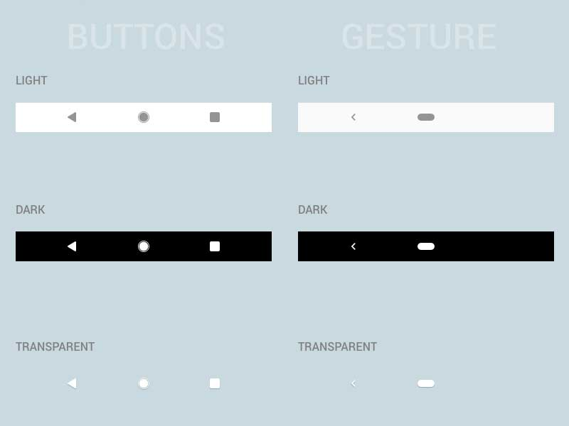

# Infinity Ui


&nbsp;&nbsp;
&nbsp;&nbsp;
<a href="https://pub.dev/packages/infinity_ui"></a>

A flutter plugin for remove status & navigation bar padding.

## Getting Started

This project is a starting point for a Flutter
[plug-in package](https://flutter.dev/developing-packages/),
a specialized package that includes platform-specific implementation code for
Android and/or iOS.

For help getting started with Flutter, view our 
[online documentation](https://flutter.dev/docs), which offers tutorials, 
samples, guidance on mobile development, and a full API reference.

* Add this to your pubspec.yaml
  ```
  dependencies:
  infinity_ui: ^0.1.2
  
  ```
* Get the package from Pub:

  ```
  flutter pub get
  ```
* Import it in your file

  ```
  import 'package:infinity_ui/infinity_ui.dart';
  ```


## Usage

 - *`Infinity Ui`* just need to enable.
 ```dart
 ...

void main() async {
  WidgetsFlutterBinding.ensureInitialized();
  await InfinityUi.enableInfinity(); // you can enable it anywhere
  runApp(MyApp());
}

...
 ```
 
 * Now for get height just using `InfinityUi` class.
 ```dart
...

  @override
  Widget build(BuildContext context) {
    return Container(
        margin: EdgeInsets.only(
            bottom: InfinityUi.navigationBarHeight,
            top: InfinityUi.statusBarHeight
        ),
        width: MediaQuery.of(context).size.width,
        height: MediaQuery.of(context).size.height,
        child: child, // your code
    ),
  }

...
 ```

 * Or if you are lazy, you can use `SafeInfinityUi`.
 ```dart
...

  @override
  Widget build(BuildContext context) {
    return SafeInfinityUi(
        background: background, // Anything you like.
        child: child, // your code
        navigationBarColor: Colors.transparent,
        statusBarColor: Colors.transparent,
    );
  }

...
 ```

 * Check out the complete [Example](https://github.com/o4x/infinity_ui/tree/master/example)

# Enjoy full transparent navigation bar in flutter😉



## Contributing
Pull requests are welcome. For major changes, please open an issue first to discuss what you would like to change.

Please make sure to update tests as appropriate.